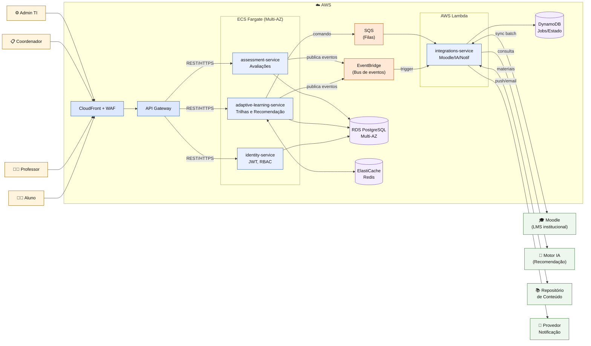

# EduVerse — Plataforma de Aprendizado Adaptativo

> **Mini Projeto "O Arquiteto Decisor" — Fase 3 (Cloud e Microsserviços)**
> Disciplina: Arquitetura de Software — UniEVANGÉLICA 2026.1
> Autor: **Gabriel Fernandes Carvalho** — Matrícula **2320142**

---

## 1. Visão Executiva

O **EduVerse** é uma plataforma de aprendizado adaptativo que opera como **camada complementar ao LMS institucional (Moodle)**, sem substituí-lo. Resolve um problema concreto e recorrente do ensino superior: o LMS institucional entrega *acesso ao conteúdo*, mas não entrega *personalização da jornada de aprendizagem*. O EduVerse preenche essa lacuna oferecendo:

- **Trilhas adaptativas** ajustadas ao progresso individual do aluno.
- **Recomendações de conteúdo** geradas por motor de IA.
- **Acompanhamento pedagógico** integrado para professor e coordenador.
- **Coexistência transparente** com Moodle (matrículas, notas, turmas sincronizadas).

### Estado atual — Fase 3

| Fase | Estilo arquitetural | Status |
|---|---|---|
| Fase 1 | Modelagem inicial e RNFs | ✅ Concluída |
| Fase 2 | **Monolito modular com Arquitetura Hexagonal** ([ADR-002](docs/adrs/ADR-002-arquitetura-hexagonal.md)) | ✅ Concluída |
| **Fase 3** | **Cloud-Native — 4 microsserviços em AWS (Fargate + Lambda)** | 🚧 **ADRs e SAD aprovados, scaffolding iniciado** |

A Fase 3 evolui a arquitetura sem invalidar a Fase 2: o isolamento de domínio entregue pela Hexagonal foi a precondição que tornou a decomposição em microsserviços barata e segura. Cada bounded context virou um serviço autônomo.

---

## 2. Diagrama C4 Nível 2 — Containers (Fase 3)



---

## 3. Documentação Arquitetural

### 3.1 ADRs (Architecture Decision Records)

| ADR | Decisão | Link |
|---|---|---|
| **0001** | Estratégia de Nuvem e Escalabilidade — AWS PaaS + Serverless híbrido, escalabilidade horizontal | [docs/adrs/0001-estrategia-nuvem.md](docs/adrs/0001-estrategia-nuvem.md) |
| **0002** | Padrões de Resiliência — API Gateway + Circuit Breaker + Bulkhead + Retry | [docs/adrs/0002-padrao-resiliencia.md](docs/adrs/0002-padrao-resiliencia.md) |
| **0003** | Modelo de Comunicação — Híbrido REST síncrono + EventBridge/SQS assíncrono | [docs/adrs/0003-modelo-comunicacao.md](docs/adrs/0003-modelo-comunicacao.md) |
| 002 (legado) | Adoção de Arquitetura Hexagonal (Fase 2 — precondição) | [docs/adrs/ADR-002-arquitetura-hexagonal.md](docs/adrs/ADR-002-arquitetura-hexagonal.md) |

### 3.2 SAD — Software Architecture Document

- **Fase 3:** [docs/sad/sad-fase3.md](docs/sad/sad-fase3.md) — visão completa da arquitetura cloud-native.
- **Fases 1–2 (histórico):** [docs/mini-projeto-eduverse-2320142.md](docs/mini-projeto-eduverse-2320142.md).

### 3.3 Diagramas

- [docs/diagrams/c4-contexto-eduverse.mmd](docs/diagrams/c4-contexto-eduverse.mmd) — C4 Nível 1 (Contexto)
- [docs/diagrams/c4-containers-eduverse.mmd](docs/diagrams/c4-containers-eduverse.mmd) — C4 Nível 2 (Containers — versão Fase 2)
- [docs/diagrams/ports-adapters-eduverse.mmd](docs/diagrams/ports-adapters-eduverse.mmd) — Mapa de Ports & Adapters

---

## 4. Estrutura do Repositório

```text
eduverse-architecture-sad/
├── README.md                          # este dossiê
├── .gitignore
├── src/                               # scaffolding dos 4 microsserviços
│   ├── identity-service/
│   ├── adaptive-learning-service/
│   ├── assessment-service/
│   └── integrations-service/
├── docs/
│   ├── adrs/                          # decisões arquiteturais
│   │   ├── 0001-estrategia-nuvem.md
│   │   ├── 0002-padrao-resiliencia.md
│   │   ├── 0003-modelo-comunicacao.md
│   │   └── ADR-002-arquitetura-hexagonal.md
│   ├── sad/
│   │   └── sad-fase3.md               # SAD Fase 3 (cloud-native)
│   └── diagrams/                      # diagramas Mermaid + PNG
└── gold-plating/                      # artefatos extras (IaC, observabilidade)
```

---

## 5. Como Executar o Projeto Localmente

> A Fase 3 está em **scaffolding**. Os serviços ainda não possuem implementação completa — esta seção descreve o fluxo previsto para quando o código estiver presente.

### 5.1 Pré-requisitos

- **Docker Desktop** ≥ 4.x (Compose v2)
- **Java 21** (para os 3 serviços Fargate)
- **Node 20+** (para `integrations-service` em Lambda)
- **AWS CLI** configurado (`aws configure`) — somente para deploy
- **Terraform** ≥ 1.7 (somente para infraestrutura)

### 5.2 Clonar e inspecionar

```bash
git clone https://github.com/<org>/eduverse-architecture-sad.git
cd eduverse-architecture-sad
```

### 5.3 Executar todos os serviços localmente (Docker Compose)

```bash
# Sobe Postgres, Redis, LocalStack (emula EventBridge/SQS/DynamoDB)
docker compose -f src/docker-compose.dev.yml up -d

# Cada serviço Fargate (Java):
cd src/identity-service && ./mvnw spring-boot:run
cd src/adaptive-learning-service && ./mvnw spring-boot:run
cd src/assessment-service && ./mvnw spring-boot:run

# Serviço Lambda (Node) localmente via SAM:
cd src/integrations-service && sam local start-lambda
```

### 5.4 Endpoints locais

| Serviço | URL local |
|---|---|
| API Gateway (proxy) | http://localhost:8080 |
| identity-service | http://localhost:8081 |
| adaptive-learning-service | http://localhost:8082 |
| assessment-service | http://localhost:8083 |
| integrations-service (SAM) | http://localhost:3001 |

### 5.5 Deploy AWS (Fase 3)

```bash
cd gold-plating/terraform
terraform init
terraform plan -var-file=dev.tfvars
terraform apply
```

---

## 6. Decisão Arquitetural Central da Fase 3

O EduVerse migra de **monolito modular hexagonal** para **4 microsserviços cloud-native em AWS**, mantendo a Arquitetura Hexagonal **internamente** em cada serviço. Esta combinação entrega simultaneamente:

- **Escalabilidade horizontal** independente por bounded context ([ADR-0001](docs/adrs/0001-estrategia-nuvem.md)).
- **Resiliência em camadas** contra falhas distribuídas — sem cair em *cascading failure* da IA ou Moodle ([ADR-0002](docs/adrs/0002-padrao-resiliencia.md)).
- **Modelo de comunicação adequado a cada fluxo** — síncrono onde o usuário espera, assíncrono onde a integração tolera ([ADR-0003](docs/adrs/0003-modelo-comunicacao.md)).
- **Domínio pedagógico preservado** — Regra de Dependência da Clean Architecture mantida em cada serviço.

---

## 7. Referências de Base

- BASS, L.; CLEMENTS, P.; KAZMAN, R. *Software Architecture in Practice*. 3ª ed. Addison-Wesley, 2012.
- MARTIN, R. C. *Clean Architecture*. Prentice Hall, 2017.
- NEWMAN, S. *Building Microservices*. 2ª ed. O'Reilly, 2021.
- NYGARD, M. T. *Release It!*. 2ª ed. Pragmatic Bookshelf, 2018.
- HOHPE, G.; WOOLF, B. *Enterprise Integration Patterns*. Addison-Wesley, 2003.
- PRESSMAN, R. S. *Engenharia de Software*. 7ª ed. AMGH, 2011.
- ISO/IEC 25010:2011.
- AWS Well-Architected Framework.
- [C4 Model](https://c4model.com/).
