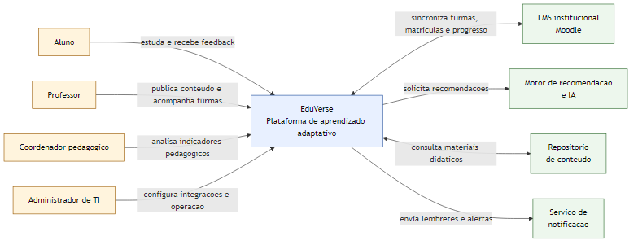
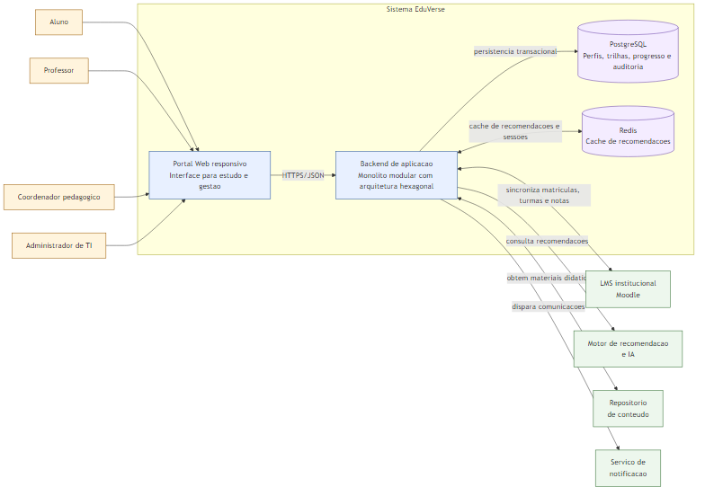
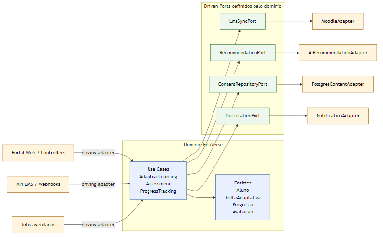

# Mini Projeto "O Arquiteto Decisor" - EduVerse

**Aluno:** Gabriel Fernandes de Carvalho  
**Matricula:** 2320142  
**Repositorio GitHub:** https://github.com/GabrielGFC/eduverse-architecture-sad

> Documento mestre da entrega em Markdown. Este arquivo consolida o **Ciclo 1 corrigido**, o **Ciclo 2 completo** e um **roadmap orientador para o Ciclo 3**.

---

## CICLO 1: Visao e Requisitos (Fase 1 corrigida)

### 1.1 Resumo do cenario de negocio

O **EduVerse** e uma plataforma de aprendizado adaptativo que atua como camada complementar ao LMS institucional da instituicao, como o **Moodle**, sem substitui-lo imediatamente. O problema de negocio atacado pelo projeto e a padronizacao excessiva das experiencias de ensino online: alunos com ritmos, lacunas de conhecimento e estilos de aprendizagem diferentes acabam recebendo a mesma trilha de estudo, o que reduz engajamento, piora a retencao e dificulta o acompanhamento pedagogico.

A proposta do EduVerse e coletar eventos de aprendizagem, analisar desempenho e entregar recomendacoes personalizadas de conteudo, revisao e avaliacao. Essa solucao precisa conviver com o ambiente academico existente, sincronizando matriculas, turmas, progresso e notas com o LMS da instituicao. Os usuarios considerados no escopo desta arquitetura sao **aluno**, **professor**, **coordenador pedagogico** e **administrador de TI**. Assim, o sistema cria valor pedagogico sem romper a operacao institucional ja consolidada.

### 1.2 Atributos de qualidade (RNFs) priorizados

1. **Escalabilidade**  
   O EduVerse precisa suportar picos de uso em periodos como semana de provas, liberacao de simulados e vespera de prazos de entrega. Nesses momentos, muitos alunos acessam simultaneamente a plataforma para revisar conteudo e receber recomendacoes personalizadas. A arquitetura deve crescer sem reescrita do nucleo do sistema e sem degradacao acentuada da experiencia.

2. **Usabilidade**  
   O sistema deve funcionar bem em navegadores comuns e em celulares de baixo custo, pois parte relevante do publico estudantil acessa recursos educacionais por dispositivos com capacidade limitada e conexoes instaveis. Isso exige telas simples, fluxo direto de estudo e baixa dependencia de interfaces pesadas.

3. **Manutenibilidade**  
   Professores e coordenadores precisam atualizar trilhas, conteudos e parametros pedagogicos sem depender continuamente da equipe de TI. Por isso, a arquitetura deve manter responsabilidades bem separadas e reduzir o acoplamento entre regras de negocio, persistencia e integracoes externas.

4. **Desempenho**  
   O valor adaptativo do EduVerse depende de respostas rapidas. Recomendacoes lentas quebram a continuidade do estudo e reduzem a percepcao de personalizacao. O objetivo arquitetural e manter o retorno das principais interacoes pedagogicas em tempo suficientemente curto para preservar o fluxo de aprendizagem, usando cache e isolamento de operacoes externas.

5. **Seguranca e privacidade**  
   O EduVerse trata dados pessoais e educacionais, como historico de progresso, desempenho em avaliacoes e padroes de uso. A solucao deve respeitar a LGPD e preservar rastreabilidade, controle de acesso e protecao contra exposicao indevida desses dados.

### 1.3 Diagrama de Contexto (C4 Nivel 1)

O diagrama abaixo apresenta o EduVerse como caixa-preta e explicita a restricao central do cenario: a coexistencia com o LMS institucional.

**Leitura do contexto:**

- O **Aluno** interage com a plataforma para estudar, receber feedback e acompanhar progresso.
- O **Professor** publica conteudos, acompanha turmas e analisa desempenho.
- O **Coordenador pedagogico** acompanha indicadores de engajamento, progresso e retencao.
- O **Administrador de TI** configura integracoes e acompanha a operacao da plataforma.
- O **Moodle** permanece como sistema institucional de referencia para matriculas, turmas e historico academico.
- O **Motor de IA**, o **Repositorio de Conteudo** e o **Servico de Notificacao** aparecem como sistemas externos obrigatorios ao contexto do EduVerse.

### 1.4 Classificacao da estrategia

- **Classificacao:** Balanceada
- **Justificativa:** A estrategia do EduVerse nao e conservadora, porque o projeto aposta em adaptacao de aprendizagem apoiada por IA como diferencial pedagogico. Tambem nao e ousada ao ponto de propor a substituicao imediata do LMS institucional, o que aumentaria risco tecnico, custo de implantacao e resistencia organizacional. Conforme Pressman (2011), decisoes arquiteturais devem responder ao risco e ao contexto do projeto. Neste caso, a melhor decisao e equilibrar inovacao na camada adaptativa com integracao gradual ao Moodle, preservando viabilidade institucional e evolucao sustentavel.

---

## CICLO 2: Blueprint e Decisoes (Fase 2)

### 2.1 Diagrama de Containers (C4 Nivel 2)

O diagrama de containers detalha os principais blocos internos do EduVerse e suas relacoes com os sistemas externos.

**Containers internos considerados:**

- **Portal Web Responsivo:** interface unica para alunos, professores, coordenacao e operacao.
- **Backend de Aplicacao:** container central que implementa autenticacao, casos de uso pedagogicos e integracoes.
- **PostgreSQL:** persistencia transacional de perfis, trilhas, progresso, conteudos e auditoria.
- **Redis:** cache de recomendacoes e suporte a respostas rapidas nas interacoes de estudo.

### 2.2 Estilo arquitetural escolhido e saneamento do modelo anterior

O EduVerse adota um **monolito modular com Arquitetura Hexagonal (Ports & Adapters) e principios de Clean Architecture** no backend. Essa escolha foi feita para corrigir o principal risco observado no modelo anterior: o dominio pedagogico ficar contaminado por detalhes de infraestrutura, como framework web, ORM, banco de dados ou integracoes externas.

No arranjo inadequado inspirado em N-Tier, era facil cair no problema classico de colocar regras de negocio junto com detalhes de persistencia, fazendo entidades dependerem de anotacoes, bibliotecas e modelos impostos pelo banco de dados. Esse acoplamento aumenta custo de manutencao, dificulta teste e torna a troca de integracoes algo cara. A correcao proposta para o Ciclo 2 aplica a **Regra de Dependencia** de Martin (2017): as dependencias devem apontar para dentro, e o dominio nao pode conhecer a infraestrutura.

No EduVerse, isso significa:

- o dominio define **portas** para sincronizar LMS, solicitar recomendacoes, recuperar conteudos e enviar notificacoes
- a infraestrutura implementa essas portas em **adaptadores** substituiveis
- os casos de uso continuam validos mesmo se Moodle, motor de IA, cache ou tecnologia de persistencia forem trocados no futuro

**Trade-offs da decisao arquitetural:**

1. **Pro - Manutenibilidade alta:** regras pedagogicas ficam isoladas das tecnologias externas.
2. **Pro - Testabilidade real:** casos de uso podem ser validados com fakes, sem subir banco nem LMS.
3. **Pro - Evolucao controlada:** a coexistencia com Moodle e outras integracoes pode evoluir sem reescrever o dominio.
4. **Contra - Maior disciplina de modelagem:** a equipe precisa manter interfaces e limites arquiteturais de forma consciente.
5. **Contra - Mais abstracao no inicio:** controllers, DTOs, portas e adaptadores exigem mais organizacao que um CRUD direto.
6. **Contra - Curva de aprendizado:** a equipe precisa compreender bem o papel de driving ports e driven ports.

### 2.3 Architecture Decision Record (ADR) principal

O ADR principal desta fase esta registrado em [`../adrs/ADR-002-arquitetura-hexagonal.md`](../adrs/ADR-002-arquitetura-hexagonal.md).

**Titulo:** Adocao da Arquitetura Hexagonal para isolar o dominio pedagogico do EduVerse  
**Status:** Aceita  
**Contexto:** O sistema precisa coexistir com Moodle, integrar motor de IA, repositorio de conteudo e servicos de notificacao sem acoplar essas tecnologias ao nucleo de negocio.  
**Decisao:** Organizar o backend em torno de casos de uso e entidades de dominio, com integracoes externas feitas exclusivamente por portas e adaptadores.  
**Justificativa:** A abordagem reduz acoplamento, melhora testabilidade e preserva liberdade de evolucao tecnologica sem assumir desde o inicio o custo operacional de microsservicos distribuidos.

Como reforco visual do saneamento arquitetural, o mapa abaixo detalha a organizacao de ports & adapters adotada para o EduVerse:

### 2.4 Trade-offs entre custo financeiro e desempenho

O enunciado da fase exige uma discussao explicita entre custo financeiro e desempenho. Para o EduVerse, tres caminhos foram considerados:

| Opcao | Custo inicial | Desempenho em pico | Observacao |
| --- | --- | --- | --- |
| Monolito N-Tier simples, sem cache | Baixo | Limitado | Mais barato no inicio, mas tende a degradar com acoplamento e gargalos de recomendacao |
| Microsservicos distribuidos desde o inicio | Alto | Alto | Boa elasticidade, mas custo de operacao e complexidade sao desproporcionais ao contexto atual |
| Monolito modular com Hexagonal + PostgreSQL + Redis | Medio | Alto o suficiente | Equilibra resposta rapida, menor custo operacional e capacidade de evolucao |

A terceira opcao foi escolhida porque entrega uma relacao mais racional entre investimento e beneficio. O **PostgreSQL** cobre consistencia e rastreabilidade dos dados educacionais, enquanto o **Redis** reduz o tempo de resposta das recomendacoes mais frequentes. Com isso, o EduVerse melhora desempenho sem assumir prematuramente o custo de orquestracao, observabilidade distribuida e operacao de varios servicos independentes.

Em outras palavras, a arquitetura escolhida privilegia uma **elasticidade evolutiva**: o sistema nasce com limites claros, desacoplamento interno e mecanismos de desempenho suficientes para o cenario academico, sem pagar antecipadamente por uma distribuicao fisica que ainda nao se justifica.

---

## CICLO 3: Cloud e Resiliencia (roadmap orientador)

> Esta secao funciona como direcao futura da arquitetura. Ela organiza o proximo ciclo, mas nao deve ser apresentada como entrega concluida desta fase.

### 3.1 Estrategia de cloud e implantacao

O roadmap de implantacao privilegia um modelo gerenciado em nuvem com menor carga operacional. A direcao mais coerente para o EduVerse e iniciar com containers em ambiente gerenciado, banco relacional administrado e cache em servico dedicado. Essa abordagem preserva a estrategia balanceada: melhora observabilidade, escalabilidade e seguranca sem exigir desde o inicio uma malha distribuida complexa.

### 3.2 Analise de fragilidade e mitigacao

O ponto mais sensivel da arquitetura continua sendo a dependencia funcional de sistemas externos, em especial o motor de recomendacao e o LMS. A mitigacao planejada para o proximo ciclo inclui:

- uso mais forte de cache para reduzir chamadas repetidas ao motor de recomendacao
- fallback para trilhas padrao quando o servico adaptativo estiver indisponivel
- monitoramento de latencia e falhas de integracao
- retries controlados e circuit breaker nas comunicacoes externas mais criticas

### 3.3 Parecer tecnico final

O EduVerse foi reposicionado arquiteturalmente para responder ao contexto real do cenario: inovar na personalizacao do ensino sem ignorar a presenca do LMS institucional. A correcao do Ciclo 1 deixou explicitas as restricoes de negocio e os RNFs mais relevantes. O Ciclo 2 consolidou uma decisao arquitetural coerente, com isolamento do dominio, trade-offs declarados e uma relacao equilibrada entre custo e desempenho. O roadmap do Ciclo 3, por sua vez, preserva a continuidade da arquitetura sem antecipar complexidade desnecessaria.

---

## Referencias bibliograficas

- COCKBURN, Alistair. *Hexagonal Architecture*. 2005.
- MARTIN, Robert C. *Clean Architecture: A Craftsman's Guide to Software Structure and Design*. Prentice Hall, 2017.
- PRESSMAN, Roger S. *Engenharia de Software: Uma Abordagem Profissional*. 7a ed. AMGH, 2011.
- RICHARDS, Mark; FORD, Neal. *Fundamentals of Software Architecture: An Engineering Approach*. O'Reilly, 2020.
- C4 Model for Software Architecture. Disponivel em: [https://c4model.com/](https://c4model.com/)
- Architecture Decision Records. Disponivel em: [https://adr.github.io/](https://adr.github.io/)
