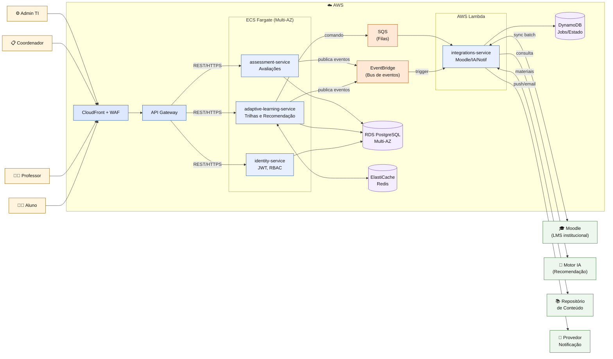

# SAD — EduVerse Fase 3 (Cloud e Microsserviços)

**Software Architecture Document — Fase 3**
**Projeto:** EduVerse — Plataforma de Aprendizado Adaptativo
**Autor:** Gabriel Fernandes Carvalho — Matrícula 2320142
**Disciplina:** Arquitetura de Software — UniEVANGÉLICA 2026.1
**Data:** 27/05/2026
**Versão:** 3.0 (Fase 3 — Cloud-Native)

---

## 1. Visão Executiva

O **EduVerse** é uma plataforma de aprendizado adaptativo que opera como camada complementar ao LMS institucional (Moodle), personalizando trilhas de estudo, recomendações por IA e feedback. Esta versão **3.0** documenta a evolução arquitetural da Fase 3: o sistema sai de um **monolito modular hexagonal** (Fase 2 — ver [ADR-002](../adrs/ADR-002-arquitetura-hexagonal.md)) para uma topologia **cloud-native baseada em 4 microsserviços** rodando em AWS Fargate + Lambda.

A evolução **não invalida** a Fase 2: o domínio pedagógico isolado pela Arquitetura Hexagonal foi a precondição que tornou a decomposição em microsserviços viável sem reescrita. Cada bounded context já claramente delineado virou um serviço autônomo.

### Estado atual da Fase 3

- ✅ ADRs do ciclo aprovados (0001 cloud, 0002 resiliência, 0003 comunicação).
- ✅ Decomposição em 4 microsserviços definida (identity, adaptive-learning, assessment, integrations).
- ✅ Diagrama C4 Nível 2 (containers) atualizado para topologia cloud.
- ⏳ Implementação dos serviços em estágio inicial (scaffolding em `src/`).
- ⏳ Infraestrutura como código (Terraform) a iniciar.

---

## 2. Drivers Arquiteturais

### 2.1 Requisitos não funcionais priorizados

| RNF | Métrica alvo | Decisão que atende |
|---|---|---|
| Disponibilidade | 99,5% mensal | RDS Multi-AZ + Fargate em ≥ 2 AZ ([ADR-0001](../adrs/0001-estrategia-nuvem.md)) |
| Latência interativa | p95 < 500 ms em dashboard | Fargate + ElastiCache + CloudFront |
| Tolerância a falha externa | Falha do motor de IA não bloqueia avaliação | Bulkhead + fallback degradado ([ADR-0002](../adrs/0002-padrao-resiliencia.md)) |
| Escalabilidade em pico | Absorver 10–30× a média em janelas de avaliação | Auto Scaling horizontal ECS + concorrência Lambda |
| Manutenibilidade | Time pequeno consegue evoluir cada serviço isoladamente | Decomposição por bounded context + contratos versionados |
| Custo | Pagamento proporcional ao uso real | Fargate Spot onde tolerável + Lambda em integrações |

### 2.2 Restrições

- Coexistência obrigatória com Moodle (não pode substituir).
- Provedor AWS (créditos AWS Educate disponíveis).
- Equipe de 1 desenvolvedor — complexidade operacional precisa ser baixa.

---

## 3. Decomposição em Microsserviços

A decomposição segue **bounded contexts do DDD**, herdados diretamente dos casos de uso já modelados na Fase 2:

### 3.1 Serviços

| Serviço | Responsabilidade | Runtime | Persistência |
|---|---|---|---|
| **identity-service** | Autenticação JWT, perfis, RBAC (aluno/professor/coordenador/admin) | ECS Fargate (Java/Spring) | RDS Postgres (schema `identity`) |
| **adaptive-learning-service** | Trilhas adaptativas, recomendações, progresso pedagógico | ECS Fargate (Java/Spring) | RDS Postgres (schema `learning`) + ElastiCache |
| **assessment-service** | Avaliações, correção, feedback | ECS Fargate (Java/Spring) | RDS Postgres (schema `assessment`) |
| **integrations-service** | Adapters para Moodle, motor de IA, notificação, repositório de conteúdo | AWS Lambda (Node/TS) | DynamoDB (estado leve de jobs) |

Cada serviço mantém **internamente** a estrutura Hexagonal já validada na Fase 2 — Entities, Use Cases, Driven/Driving Ports. A descomposição apenas externalizou as fronteiras que antes eram lógicas.

### 3.2 Database-per-service

Padrão **schema-per-service em RDS compartilhado** (não banco físico separado), porque:
- Volume atual não justifica custo de N instâncias RDS.
- Schemas isolados impedem queries cross-service (regra: nenhum serviço lê schema de outro).
- Migrações independentes via Flyway por serviço.

Quando o volume crescer, a separação em instâncias físicas é refatoração reversível (cada serviço já só conhece seu schema).

---

## 4. Diagrama C4 Nível 2 — Containers (Fase 3)

O diagrama abaixo está em sintaxe Mermaid e também é renderizado inline no [README.md](../../README.md).

---

## 5. Modelo de Comunicação

Detalhado no [ADR-0003](../adrs/0003-modelo-comunicacao.md). Resumo aplicado:

- **Síncrono (REST/HTTPS):** todas as chamadas originadas no Portal Web; passam por API Gateway.
- **Assíncrono (EventBridge + SQS):** eventos de domínio (`AssessmentSubmitted`, `LearningProgressUpdated`, `EnrollmentSynced`) e commands para o `integrations-service`.
- **Envelope:** CloudEvents 1.0, com `correlationId` propagado em todas as fronteiras para tracing X-Ray.

---

## 6. Resiliência e Disponibilidade

Detalhado no [ADR-0002](../adrs/0002-padrao-resiliencia.md). Aplicação por camada:

| Camada | Padrão | Implementação |
|---|---|---|
| Borda | Rate limiting + WAF | API Gateway |
| Serviço-a-serviço | Circuit Breaker | Resilience4j (Java) / opossum (Node) |
| Recursos internos | Bulkhead | Pool isolado por dependency adapter |
| Falha transiente | Retry com backoff + jitter | SDK AWS + Resilience4j |
| Degradação | Fallback estático | Trilha padrão quando IA indisponível |

---

## 7. Estratégia de Cloud

Detalhado no [ADR-0001](../adrs/0001-estrategia-nuvem.md):

- **Provedor:** AWS (único).
- **Modelo:** PaaS (Fargate, RDS, ElastiCache) + Serverless (Lambda, EventBridge, SQS).
- **Escalabilidade:** horizontal por padrão; vertical apenas em RDS.
- **Observabilidade:** CloudWatch Logs + Metrics + X-Ray (tracing distribuído obrigatório).
- **IaC:** Terraform (gold-plating planejado).

---

## 8. Atributos de Qualidade (ISO/IEC 25010) e como são atendidos

| Característica | Subcaracterística | Mecanismo no EduVerse |
|---|---|---|
| Performance Efficiency | Capacity, Resource utilization | Auto Scaling Fargate + Lambda elástico |
| Reliability | Availability, Fault Tolerance, Recoverability | Multi-AZ, Circuit Breaker, RDS automated backup, SQS retry |
| Maintainability | Modularity, Modifiability, Testability | Bounded contexts, Hexagonal interno, contratos versionados |
| Security | Authenticity, Confidentiality | WAF, JWT, TLS, IAM mínimo privilégio |
| Compatibility | Interoperability | OpenAPI + CloudEvents, sincronização Moodle preservada |
| Portability | Adaptability | Domínio livre de SDK AWS (adapters concentram dependência) |

---

## 9. Riscos Arquiteturais e Mitigações

| Risco | Probabilidade | Impacto | Mitigação |
|---|---|---|---|
| Custo AWS exceder créditos educacionais | Média | Alto | Budget alarms + uso de Spot + revisão semanal |
| Complexidade operacional para 1 dev | Alta | Médio | Escolha por PaaS/Serverless em vez de K8s; IaC desde dia 1 |
| Consistência eventual confundir UX | Média | Médio | UI com estado "processando" explícito em fluxos assíncronos |
| Lock-in AWS | Baixa | Médio | Domínio isolado; adapters concentram chamadas a SDK |
| Falha em cascata por dependência externa (IA, Moodle) | Média | Alto | Padrões do ADR-0002 (Breaker + Bulkhead + Fallback) |

---

## 10. Roadmap incremental da Fase 3

1. **Sprint 0** — IaC base (rede, RDS, IAM), pipeline CI/CD por serviço.
2. **Sprint 1** — `identity-service` em Fargate + API Gateway com JWT.
3. **Sprint 2** — `adaptive-learning-service` migrado do monolito, com Resilience4j integrado.
4. **Sprint 3** — `assessment-service` + EventBridge para `AssessmentSubmitted`.
5. **Sprint 4** — `integrations-service` em Lambda, consumindo eventos.
6. **Sprint 5** — observabilidade end-to-end (X-Ray, dashboards) e *chaos testing* leve.

---

## 11. Referências

- BASS, L.; CLEMENTS, P.; KAZMAN, R. *Software Architecture in Practice*. 3ª ed. Addison-Wesley, 2012.
- MARTIN, R. C. *Clean Architecture*. Prentice Hall, 2017.
- NEWMAN, S. *Building Microservices*. 2ª ed. O'Reilly, 2021.
- NYGARD, M. T. *Release It!*. 2ª ed. Pragmatic Bookshelf, 2018.
- HOHPE, G.; WOOLF, B. *Enterprise Integration Patterns*. Addison-Wesley, 2003.
- PRESSMAN, R. S. *Engenharia de Software*. 7ª ed. AMGH, 2011.
- ISO/IEC 25010:2011.
- AWS Well-Architected Framework.
- C4 Model — https://c4model.com/
